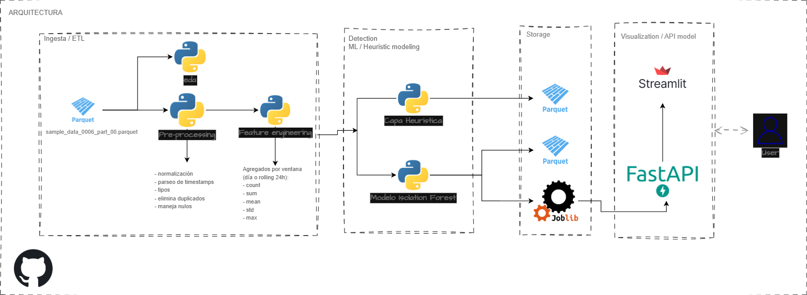
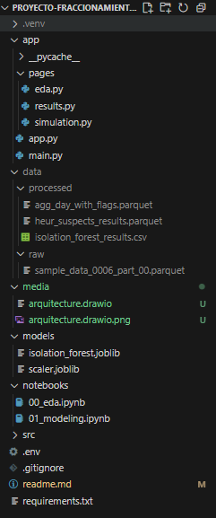

## Premisas
1. No se sube la carpeta `data`, ya que hay limites en el tamaño de los archivos en GitHub.
2. Para el pipeline end-to-end, simulando una aplicación en producción, se utiliza un conjunto reducido (una muestra de los primeros 10k registros) de datos debido a los recursos computacionales limitados. Lo mismo aplica para las visualizaciones. La lógica implementada es la misma que se aplicaría con un volumen de datos mayor. Además, lo desarrollado en los notebooks de limpieza, preprocesamiento y modelado puede integrarse fácilmente en un pipeline automatizado.
3. En los notebooks, se trabaja con todos los datos y se documenta cada paso en las celdas correspondientes. Para esta prueba específica, solo se utilizó el archivo `sample_data_0006_part_00.parquet`.
4. En el frontend se simula el ingreso de un nuevo dato (un solo registro) para probar el modelo Isolation Forest. Es solo demostrativo; el sistema puede adaptarse a predicciones por lotes por ejemplo. En esta simulación no se incluyen las reglas heurísticas, solo el modelo de machine learning.

---
## Resumen ejecutivo
### Objetivo
Detectar **fraccionamiento transaccional**: comportamiento en el que un monto grande se divide en múltiples transacciones pequeñas por la misma cuenta/cliente dentro de una ventana de 24 horas con la intención de evadir controles.

### Metodología
1. **Ingesta y limpieza**: validar datos, parsear timestamps y normalizar entradas.  
2. **Feature engineering**: generar agregados por ventana (count, sum, mean, std, max) — formato: una fila por transacción con sus features.  
3. **Detección**:
   - **Heurística** (reglas basadas en percentiles — p95/p90/p25): explicable y rápido.  
   - **IsolationForest** (no supervisado): detecta patrones multivariados no trivialmente cubiertos por reglas.  
4. **Combinación y priorización**: score modelo no supervisado con posibles outliers para rankear y priorizar top-K para revisión humana.  
5. **Operacionalización**: guardar resultados y dashboard.

### Técnicas usadas
- Heurísticas basadas en reglas (interpretables).  
- Detección de anomalías no supervisada (Isolation Forest).  
- Tools: Polars (eficiencia), scikit-learn, Streamlit, FastAPI.

### Resultado esperado y entregables
- **Producto de datos**: tabla con features por usuario-ventana y posibles sospechosos.
- **Modelo de ML serialziado**
- **Visualización en Stramlit**

---
## Flujo de datos y criterio de selección del modelo
### Flujo de datos (end-to-end)
1. **Ingesta (Raw)**  
   - Origen: archivos diarios (.parquet). 
   - Acciones: validación de esquema, normalización mínima (parseo de timestamps, tipos).

2. **ETL / Preprocesamiento**  
   - Job batch que limpia (elimina duplicados, maneja nulos).  

3. **Feature Generation (producto de datos)**  
   - Agregados por ventana (día o rolling 24h): `count`, `sum`, `mean`, `std`, `max`.  
   - Salida: `data/processed/window_24h.parquet`. Este artefacto es el *producto de datos* que alimenta scoring y dashboard.

4. **Scoring / Detección**  
   - **Capa heurística** (reglas explicables con percentiles): flags inmediatos.  
   - **Capa ML no supervisada** (IsolationForest): score continuo y etiqueta de anomalía.

5. **Dashboard**  
   - Streamlit / BI: listar top sospechosos, ver detalle de transacciones.

---
### Criterio para seleccionar el modelo final
Se consideraron dos enfoques: heurística y modelos no supervisados (IsolationForest) 
La selección se basó en estos criterios:

- **Disponibilidad de etiquetas**: No hay etiquetas verificadas: modelos supervisados no son viables inicialmente.
- **Interpretabilidad**: El negocio prioriza explicabilidad (auditoría, acciones manuales). Las reglas heurísticas son 100% explicables.
- **Robustez**: IsolationForest aporta detección automática de patrones multivariantes que la heurística puede no capturar.
- **Costo operacional**: Heurística es barata y confiable; ML añade costo computacional pero mayor automatización.

**Decisión final:**  
1. **Primera capa: Heurística** — para generar alertas interpretables y fáciles de auditar.  
2. **Segunda capa: IsolationForest** — para identificar patrones no triviales y reducir falsos negativos. 

---
## Frecuencia de actualización

- **Scoring (producción)**:
1. **cada 24 horas** (batch) con top de usuarios sospechosos, dependerá tambien de las reglas de negocio.

---
**Recursos mínimos**:
- Python + Polars, pandas, scikit-learn
- FastAPI (para inferencia) / Streamlit (dashboard)
- Storage: parquet files

---
**Arquitectura propuesta**:
- Orquestación: **Airflow**
- Feature store: BigQuery
- Model registry: **MLflow**
- Serving: **FastAPI**
- Storage: **GCS via Parquet o BigQuery via Parquet** (analítica)
- CI/CD: GitHub (build/test)
- Infra: Cloud (GCP) para escalado (Cloud Run/GKE)

---
## 1. Crear entorno virtual
- python -m venv .venv
- source .venv/bin/activate   # Windows: .venv\Scripts\activate

## 2️. Instalar dependencias
- pip install -r requirements.txt

## 3️. Ejecutar API (FastAPI)
- uvicorn app.main:app --reload --port 8000

## 4️. Ejecutar interfaz (Streamlit)
- streamlit run app/app.py. (Obs: en una nueva terminal)

- API: http://127.0.0.1:8000
- Frontend: http://localhost:8501

---
## Media

### Arquitectura

---

### Estructura Proyecto
